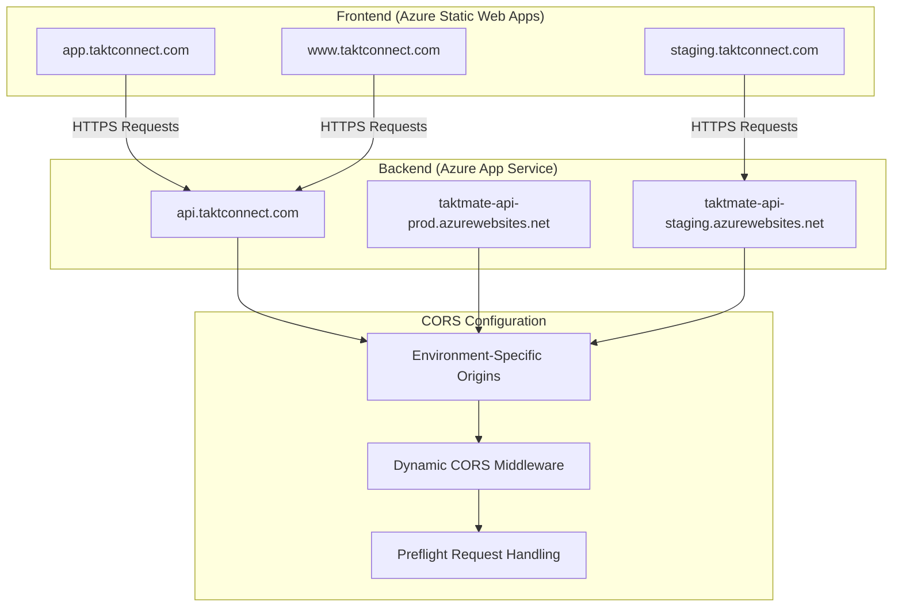

# TaktMate CORS Configuration Guide

## Overview

This guide provides comprehensive documentation for configuring and managing Cross-Origin Resource Sharing (CORS) settings for the TaktMate application across different environments. CORS is essential for enabling secure communication between the frontend application (hosted on Azure Static Web Apps) and the backend API (hosted on Azure App Service).

## Table of Contents

1. [Architecture Overview](#architecture-overview)
2. [Environment-Specific Configuration](#environment-specific-configuration)
3. [Backend CORS Implementation](#backend-cors-implementation)
4. [Frontend Integration](#frontend-integration)
5. [Azure App Service CORS](#azure-app-service-cors)
6. [Testing and Validation](#testing-and-validation)
7. [Troubleshooting](#troubleshooting)
8. [Security Best Practices](#security-best-practices)
9. [Performance Optimization](#performance-optimization)
10. [Monitoring and Maintenance](#monitoring-and-maintenance)

## Architecture Overview

### CORS Flow in TaktMate



### Key Components

1. **Dynamic CORS Configuration**: Environment-specific origin management
2. **Preflight Request Handling**: OPTIONS request processing for complex CORS requests
3. **Credential Support**: Cookie and authorization header handling
4. **Security Headers**: Proper CORS header configuration
5. **Error Handling**: Graceful CORS violation handling

## Environment-Specific Configuration

### Production Environment

**Frontend Origins:**
- `https://app.taktconnect.com` - Main application domain
- `https://www.taktconnect.com` - WWW redirect domain

**Backend APIs:**
- `https://api.taktconnect.com` - Custom domain API endpoint
- `https://taktmate-api-prod.azurewebsites.net` - Azure App Service URL

**Security Settings:**
- Strict origin checking enabled
- Limited preflight cache duration
- Comprehensive logging of CORS violations

### Staging Environment

**Frontend Origins:**
- `https://staging.taktconnect.com` - Staging application domain

**Backend APIs:**
- `https://api-staging.taktconnect.com` - Staging custom domain
- `https://taktmate-api-staging.azurewebsites.net` - Staging App Service URL

**Security Settings:**
- Relaxed origin checking for testing
- Extended preflight cache duration
- Detailed logging for debugging

### Development Environment

**Frontend Origins:**
- `https://dev.taktconnect.com` - Development domain
- `http://localhost:3000` - Local development server
- `http://127.0.0.1:3000` - Alternative local address

**Backend APIs:**
- `http://localhost:3001` - Local backend server
- `https://taktmate-api-dev.azurewebsites.net` - Development App Service

**Security Settings:**
- Permissive origin checking
- No preflight rate limiting
- Verbose debugging output

## Backend CORS Implementation

### Dynamic Configuration System

The TaktMate backend uses a dynamic CORS configuration system that automatically loads environment-specific settings:

```javascript
// backend/config/cors.js - Dynamic CORS Configuration
const corsConfig = require('./config/cors');

// Automatically detects environment and loads appropriate configuration
const corsOptions = corsConfig.createCorsMiddlewareOptions();

// Apply CORS middleware
app.use(cors(corsOptions));
```

### Environment-Specific Configuration Files

#### Production Configuration (`backend/config/cors-production.js`)

```javascript
const corsConfiguration = {
    allowedOrigins: [
        'https://app.taktconnect.com',
        'https://www.taktconnect.com',
        process.env.FRONTEND_URL,
        process.env.CORS_ORIGIN_OVERRIDE
    ].filter(Boolean),

    corsOptions: {
        origin: function(origin, callback) {
            // Strict origin validation for production
            if (!origin || corsConfiguration.allowedOrigins.includes(origin)) {
                return callback(null, true);
            }
            console.warn('CORS: Blocked origin:', origin);
            return callback(new Error('Not allowed by CORS policy'), false);
        },
        credentials: true,
        methods: ['GET', 'POST', 'PUT', 'DELETE', 'OPTIONS', 'HEAD', 'PATCH'],
        allowedHeaders: [
            'Content-Type',
            'Authorization',
            'X-Requested-With',
            'Accept',
            'Origin',
            'Cache-Control',
            'X-File-Name',
            'X-File-Size',
            'X-File-Type',
            'X-MS-CLIENT-PRINCIPAL-ID',
            'X-MS-CLIENT-PRINCIPAL-NAME',
            'X-MS-CLIENT-PRINCIPAL',
            'X-API-Version',
            'X-Request-ID',
            'X-Correlation-ID'
        ],
        exposedHeaders: [
            'X-Total-Count',
            'X-Page-Count',
            'X-Request-ID',
            'X-Correlation-ID',
            'X-Rate-Limit-Limit',
            'X-Rate-Limit-Remaining',
            'X-Rate-Limit-Reset'
        ],
        optionsSuccessStatus: 200,
        maxAge: 86400 // 24 hours
    },

    security: {
        strictOriginCheck: true,
        logViolations: true,
        preflightRateLimit: {
            windowMs: 60000,
            max: 100
        }
    }
};
```

#### Staging Configuration (`backend/config/cors-staging.js`)

```javascript
const corsConfiguration = {
    allowedOrigins: [
        'https://staging.taktconnect.com',
        'http://localhost:3000',
        'http://127.0.0.1:3000',
        process.env.FRONTEND_URL,
        process.env.CORS_ORIGIN_OVERRIDE
    ].filter(Boolean),

    security: {
        strictOriginCheck: false,
        logViolations: true,
        preflightRateLimit: {
            windowMs: 60000,
            max: 1000
        }
    }
};
```

#### Development Configuration (`backend/config/cors-development.js`)

```javascript
const corsConfiguration = {
    allowedOrigins: [
        'https://dev.taktconnect.com',
        'http://localhost:3000',
        'http://127.0.0.1:3000',
        process.env.FRONTEND_URL,
        process.env.CORS_ORIGIN_OVERRIDE
    ].filter(Boolean),

    corsOptions: {
        origin: function(origin, callback) {
            // Permissive for development
            if (process.env.NODE_ENV === 'development') {
                console.log('CORS: Allowing origin in development mode:', origin);
                return callback(null, true);
            }
            // Standard validation for non-development
            if (!origin || corsConfiguration.allowedOrigins.includes(origin)) {
                return callback(null, true);
            }
            return callback(new Error('Not allowed by CORS policy'), false);
        }
    },

    security: {
        strictOriginCheck: false,
        logViolations: true,
        preflightRateLimit: {
            windowMs: 60000,
            max: 1000
        }
    }
};
```

### CORS Middleware Integration

The backend integrates CORS middleware early in the Express.js pipeline:

```javascript
// backend/index.js
const corsConfig = require('./config/cors');

// Log CORS configuration for debugging
corsConfig.logCorsConfiguration();

// Apply CORS middleware with environment-specific configuration
app.use(cors(corsConfig.createCorsMiddlewareOptions()));
```

## Frontend Integration

### API Service Configuration

The frontend uses Axios with automatic token injection and CORS-aware configuration:

```javascript
// frontend/src/services/apiService.js
import axios from 'axios';

const apiService = axios.create({
    baseURL: process.env.REACT_APP_API_BASE_URL,
    withCredentials: true, // Enable CORS credentials
    timeout: 30000,
    headers: {
        'Content-Type': 'application/json',
        'Accept': 'application/json'
    }
});

// Request interceptor for authentication
apiService.interceptors.request.use(
    async (config) => {
        const { instance } = await import('../contexts/AuthContext');
        const accessToken = await instance.acquireTokenSilent({
            scopes: [process.env.REACT_APP_AZURE_AD_B2C_SCOPE],
            account: instance.getActiveAccount()
        });
        
        if (accessToken) {
            config.headers.Authorization = `Bearer ${accessToken.accessToken}`;
        }
        
        return config;
    },
    (error) => Promise.reject(error)
);

// Response interceptor for error handling
apiService.interceptors.response.use(
    (response) => response,
    async (error) => {
        if (error.response?.status === 401) {
            // Handle token refresh or redirect to login
        }
        return Promise.reject(error);
    }
);
```

### Environment Variables

Frontend environment variables for CORS configuration:

```bash
# Production (.env.production)
REACT_APP_API_BASE_URL=https://api.taktconnect.com

# Staging (.env.staging)
REACT_APP_API_BASE_URL=https://api-staging.taktconnect.com

# Development (.env.development)
REACT_APP_API_BASE_URL=http://localhost:3001
```

## Azure App Service CORS

### Azure Portal Configuration

Configure CORS in Azure App Service through the Azure Portal:

1. Navigate to your App Service in Azure Portal
2. Go to **API** → **CORS**
3. Add allowed origins:
   - `https://app.taktconnect.com`
   - `https://www.taktconnect.com`
   - `https://staging.taktconnect.com` (for staging)
4. Enable **Access-Control-Allow-Credentials**
5. Save the configuration

### Azure CLI Configuration

Automate CORS configuration using Azure CLI:

```bash
# Configure CORS origins
az webapp cors add \
    --resource-group taktmate-prod-rg \
    --name taktmate-api-prod \
    --allowed-origins https://app.taktconnect.com https://www.taktconnect.com

# Enable credentials support
az webapp cors credentials \
    --resource-group taktmate-prod-rg \
    --name taktmate-api-prod \
    --enable
```

### ARM Template Configuration

Include CORS configuration in ARM templates:

```json
{
    "type": "Microsoft.Web/sites/config",
    "apiVersion": "2021-02-01",
    "name": "[concat(parameters('appServiceName'), '/web')]",
    "properties": {
        "cors": {
            "allowedOrigins": [
                "https://app.taktconnect.com",
                "https://www.taktconnect.com"
            ],
            "supportCredentials": true
        }
    }
}
```

## Testing and Validation

### Automated Testing Scripts

#### CORS Configuration Testing

```bash
# Test CORS configuration for production
./azure/configure-cors-settings.sh production taktconnect.com --validate --test --report

# Test all environments
./azure/configure-cors-settings.sh all taktconnect.com --comprehensive --report
```

#### CORS Functionality Testing

```bash
# Comprehensive CORS functionality testing
./azure/test-cors-functionality.sh production taktconnect.com --comprehensive --report

# Test specific aspects
./azure/test-cors-functionality.sh production taktconnect.com --preflight --headers --origins
```

### Manual Testing

#### Browser Developer Tools

1. Open browser developer tools (F12)
2. Navigate to Network tab
3. Make requests to the API
4. Check for CORS-related errors in console
5. Verify CORS headers in response headers

#### CORS Headers to Verify

- `Access-Control-Allow-Origin`: Should match request origin
- `Access-Control-Allow-Credentials`: Should be `true`
- `Access-Control-Allow-Methods`: Should include required methods
- `Access-Control-Allow-Headers`: Should include custom headers
- `Access-Control-Expose-Headers`: Should expose custom response headers

#### Common Test Scenarios

1. **Simple Requests**: GET requests with standard headers
2. **Preflight Requests**: POST/PUT requests with custom headers
3. **Credential Requests**: Requests with cookies or authorization headers
4. **Cross-Origin Requests**: Requests from different domains
5. **Error Handling**: Requests from blocked origins

### Test Results Analysis

#### Expected Results

```json
{
    "environment": "production",
    "domain": "taktconnect.com",
    "summary": {
        "total_tests": 45,
        "passed": 42,
        "failed": 0,
        "warnings": 3,
        "success_rate": 93.3
    },
    "test_categories": {
        "preflight": 12,
        "headers": 10,
        "origins": 8,
        "methods": 8,
        "credentials": 4,
        "browser": 3
    }
}
```

## Troubleshooting

### Common CORS Issues

#### 1. Origin Not Allowed

**Error**: `Access to fetch at 'API_URL' from origin 'FRONTEND_URL' has been blocked by CORS policy: No 'Access-Control-Allow-Origin' header is present`

**Solution**:
- Verify frontend URL is in `allowedOrigins` configuration
- Check environment-specific configuration file
- Ensure backend is using correct environment configuration

#### 2. Preflight Request Failed

**Error**: `Access to fetch at 'API_URL' from origin 'FRONTEND_URL' has been blocked by CORS policy: Response to preflight request doesn't pass access control check`

**Solution**:
- Verify OPTIONS method is allowed
- Check `Access-Control-Allow-Methods` header
- Ensure custom headers are in `allowedHeaders` configuration

#### 3. Credentials Not Allowed

**Error**: `Access to fetch at 'API_URL' from origin 'FRONTEND_URL' has been blocked by CORS policy: The value of the 'Access-Control-Allow-Origin' header in the response must not be the wildcard '*' when the request's credentials mode is 'include'`

**Solution**:
- Ensure `credentials: true` in CORS configuration
- Verify specific origins instead of wildcard
- Check `Access-Control-Allow-Credentials` header is `true`

#### 4. Custom Headers Blocked

**Error**: `Access to fetch at 'API_URL' from origin 'FRONTEND_URL' has been blocked by CORS policy: Request header field 'X-Custom-Header' is not allowed by Access-Control-Allow-Headers`

**Solution**:
- Add custom headers to `allowedHeaders` configuration
- Verify preflight request includes required headers
- Check `Access-Control-Allow-Headers` response header

### Debugging Steps

1. **Check Browser Console**: Look for CORS-related error messages
2. **Inspect Network Tab**: Examine request/response headers
3. **Verify Configuration**: Ensure correct environment configuration is loaded
4. **Test with curl**: Use command-line tools to test CORS requests
5. **Check Backend Logs**: Look for CORS violation logs
6. **Validate Origins**: Ensure frontend and backend URLs match exactly

### Environment-Specific Issues

#### Production Issues

- Strict origin checking may block legitimate requests
- SSL certificate issues can affect CORS
- Custom domain configuration may need DNS updates

#### Staging Issues

- Mixed HTTP/HTTPS requests may be blocked
- Temporary domain changes may not be reflected in configuration

#### Development Issues

- Local development server URL changes
- Mixed localhost/127.0.0.1 configurations
- Hot reloading may cause temporary CORS issues

## Security Best Practices

### Origin Validation

1. **Explicit Origin Lists**: Never use wildcard (*) in production
2. **Environment-Specific Origins**: Different origins for different environments
3. **Subdomain Restrictions**: Be specific about subdomain access
4. **Protocol Enforcement**: Require HTTPS in production

### Header Configuration

1. **Minimal Exposed Headers**: Only expose necessary response headers
2. **Required Headers Only**: Only allow necessary request headers
3. **Method Restrictions**: Limit allowed HTTP methods
4. **Credential Handling**: Carefully control credential access

### Monitoring and Logging

1. **CORS Violation Logging**: Log blocked requests for security analysis
2. **Origin Tracking**: Monitor origin patterns for anomalies
3. **Rate Limiting**: Implement preflight request rate limiting
4. **Security Alerts**: Alert on suspicious CORS patterns

### Configuration Management

1. **Environment Separation**: Separate configurations for each environment
2. **Secret Management**: Use environment variables for sensitive configuration
3. **Version Control**: Track configuration changes
4. **Automated Validation**: Test configuration changes automatically

## Performance Optimization

### Preflight Request Optimization

1. **Cache Control**: Set appropriate `maxAge` for preflight responses
2. **Minimal Headers**: Only include necessary headers in preflight responses
3. **Route Optimization**: Optimize OPTIONS request handling
4. **CDN Configuration**: Configure CDN for CORS headers

### Response Header Optimization

1. **Header Compression**: Enable gzip compression for responses
2. **Minimal Headers**: Only include necessary CORS headers
3. **Caching Strategy**: Cache CORS responses appropriately
4. **Connection Reuse**: Enable HTTP/2 and connection pooling

### Network Optimization

1. **DNS Optimization**: Optimize DNS resolution for cross-origin requests
2. **SSL Optimization**: Use optimized SSL configuration
3. **Geographic Distribution**: Use CDN for global performance
4. **Connection Pooling**: Reuse connections for multiple requests

## Monitoring and Maintenance

### Application Insights Integration

Monitor CORS performance and issues using Application Insights:

```javascript
// Track CORS violations
appInsights.trackEvent('CORS_Violation', {
    origin: blockedOrigin,
    endpoint: requestPath,
    method: requestMethod
});

// Track CORS performance
appInsights.trackMetric('CORS_Preflight_Duration', preflightDuration);
```

### Health Checks

Implement CORS health checks:

```javascript
// CORS health check endpoint
app.get('/health/cors', (req, res) => {
    const corsConfig = require('./config/cors');
    const validation = corsConfig.validateAllEnvironments();
    
    res.json({
        status: 'healthy',
        cors_configuration: validation,
        timestamp: new Date().toISOString()
    });
});
```

### Automated Monitoring

Set up automated CORS monitoring:

```bash
# Daily CORS configuration validation
0 6 * * * /path/to/azure/configure-cors-settings.sh production taktconnect.com --validate --report

# Weekly comprehensive CORS testing
0 2 * * 0 /path/to/azure/test-cors-functionality.sh all taktconnect.com --comprehensive --report
```

### Alert Configuration

Configure alerts for CORS issues:

1. **High CORS Violation Rate**: Alert when blocked requests exceed threshold
2. **Configuration Changes**: Alert when CORS configuration is modified
3. **Performance Issues**: Alert when CORS requests are slow
4. **Security Incidents**: Alert on suspicious CORS patterns

## Configuration Files Reference

### Backend Configuration Files

- `backend/config/cors.js` - Dynamic CORS configuration module
- `backend/config/cors-production.js` - Production CORS settings
- `backend/config/cors-staging.js` - Staging CORS settings
- `backend/config/cors-development.js` - Development CORS settings

### Azure Configuration Scripts

- `azure/configure-cors-settings.sh` - CORS configuration management script
- `azure/test-cors-functionality.sh` - CORS functionality testing script

### Environment Files

- `backend/env.production` - Production environment variables
- `backend/env.staging` - Staging environment variables
- `frontend/env.production` - Frontend production environment variables
- `frontend/env.staging` - Frontend staging environment variables

## Conclusion

Proper CORS configuration is essential for the TaktMate application's security and functionality. This guide provides comprehensive coverage of CORS implementation, testing, and maintenance across all environments. Regular testing and monitoring ensure that CORS configuration remains secure and functional as the application evolves.

For additional support or questions about CORS configuration, refer to the automated testing scripts and monitoring tools provided in this guide.
