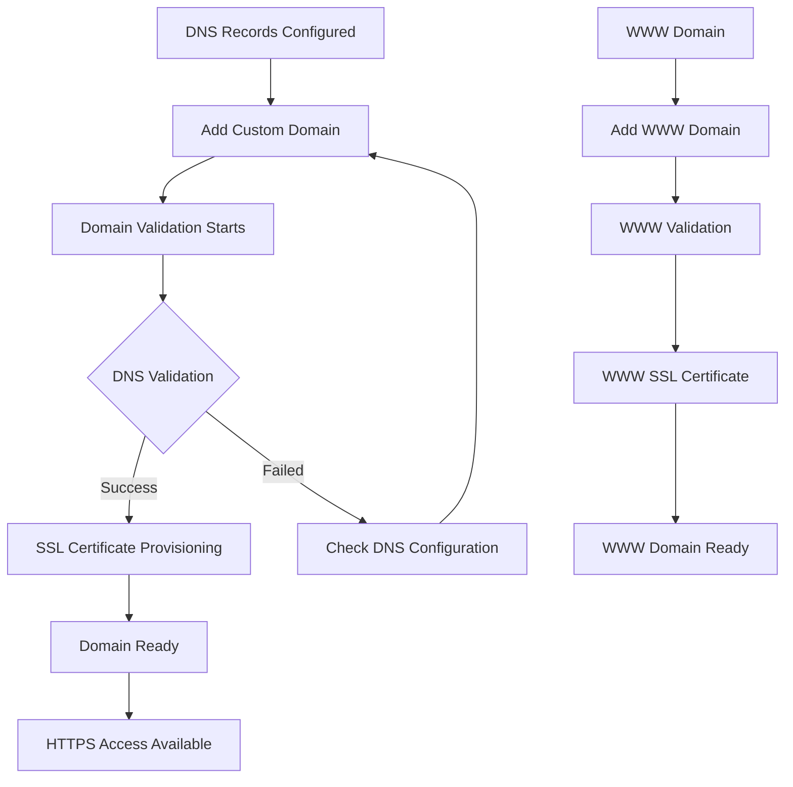

# Azure Static Web Apps Custom Domain Configuration Guide

## Overview
This guide provides comprehensive instructions for configuring custom domains in Azure Static Web Apps for the TaktMate application. It covers domain setup, SSL certificate management, validation procedures, and troubleshooting for both production and non-production environments.

## 🏗️ Static Web Apps Domain Architecture

### Domain Configuration Structure
```
┌─────────────────────────────────────────────────────────────┐
│                Azure Static Web Apps Domain Setup          │
├─────────────────────────────────────────────────────────────┤
│  ┌─────────────────┐  ┌──────────────────┐  ┌─────────────┐ │
│  │   Production    │  │     Staging      │  │ Development │ │
│  │app.taktconnect  │  │staging.taktconnect│  │dev.taktconnect│
│  │     .com        │  │     .com         │  │    .com     │ │
│  │                 │  │                  │  │             │ │
│  │ + www redirect  │  │                  │  │             │ │
│  └─────────────────┘  └──────────────────┘  └─────────────┘ │
├─────────────────────────────────────────────────────────────┤
│                      ↓ CNAME Records ↓                     │
├─────────────────────────────────────────────────────────────┤
│  ┌─────────────────┐  ┌──────────────────┐  ┌─────────────┐ │
│  │   Production    │  │     Staging      │  │ Development │ │
│  │   Static Web    │  │   Static Web     │  │ Static Web  │ │
│  │      App        │  │      App         │  │    App      │ │
│  │.azurestaticapps │  │.azurestaticapps  │  │.azurestaticapps│
│  │     .net        │  │     .net         │  │    .net     │ │
│  └─────────────────┘  └──────────────────┘  └─────────────┘ │
└─────────────────────────────────────────────────────────────┘
```

### SSL Certificate Management
```yaml
SSL Certificate Features:
  Automatic Provisioning: ✅ Azure manages SSL certificates
  Let's Encrypt Integration: ✅ Free SSL certificates
  Automatic Renewal: ✅ Certificates renew automatically
  Multiple Domain Support: ✅ Main domain + WWW domain
  Wildcard Support: ❌ Not supported in Static Web Apps
  Custom Certificate Upload: ❌ Not supported in Static Web Apps

Certificate Validation:
  Domain Validation: DNS-based validation (automatic)
  Certificate Authority: Let's Encrypt or DigiCert
  Validation Time: Up to 24 hours for initial provisioning
  Renewal Period: Automatic renewal before expiration
```

## 🛠️ Custom Domain Configuration Tools

### 1. Static Web App Domain Configuration Script
**File**: `azure/configure-static-web-app-domains.sh`

#### Key Features
- **Multi-environment support** (production, staging, development)
- **Automated domain configuration** with Azure CLI integration
- **SSL certificate management** and validation
- **Domain validation** and DNS verification
- **WWW domain configuration** (production only)
- **Comprehensive error handling** and retry logic

#### Usage Examples
```bash
# Configure production custom domain with SSL
./configure-static-web-app-domains.sh production taktconnect.com --validate --ssl

# Staging environment setup with dry-run
./configure-static-web-app-domains.sh staging taktconnect.com --dry-run --verbose

# Force domain configuration (skip validation)
./configure-static-web-app-domains.sh production taktconnect.com --force --ssl
```

### 2. Static Web App Domain Testing Script
**File**: `azure/test-static-web-app-domains.sh`

#### Testing Capabilities
- **Static Web App configuration** validation
- **Custom domain status** and validation checks
- **Domain accessibility** testing (HTTP/HTTPS)
- **SSL certificate verification** and security analysis
- **Security headers** validation
- **Performance testing** (response times, DNS resolution)
- **Content delivery** verification

#### Usage Examples
```bash
# Comprehensive domain testing with report
./test-static-web-app-domains.sh production taktconnect.com --comprehensive --report

# SSL and security testing
./test-static-web-app-domains.sh production taktconnect.com --ssl --security --verbose

# Performance testing only
./test-static-web-app-domains.sh production taktconnect.com --performance
```

## 📋 Step-by-Step Domain Setup

### Prerequisites
1. **Azure CLI** installed and authenticated
2. **DNS records** configured (from Task 7.1)
3. **Static Web App** deployed and ready
4. **Domain ownership** verified

### Step 1: Verify Static Web App Status
```bash
# Check Static Web App exists and is ready
az staticwebapp show --name taktmate-frontend-prod --resource-group taktmate-prod-rg --query state

# Get default hostname
az staticwebapp show --name taktmate-frontend-prod --resource-group taktmate-prod-rg --query defaultHostname
```

### Step 2: Verify DNS Configuration
```bash
# Ensure DNS records are configured and propagated
nslookup app.taktconnect.com
dig app.taktconnect.com CNAME

# Verify DNS points to correct Static Web App
# Expected: app.taktconnect.com → taktmate-frontend-prod.azurestaticapps.net
```

### Step 3: Configure Custom Domain
```bash
# Production environment domain configuration
./configure-static-web-app-domains.sh production taktconnect.com --validate --ssl

# Monitor domain validation progress
az staticwebapp hostname show \
  --name taktmate-frontend-prod \
  --resource-group taktmate-prod-rg \
  --hostname app.taktconnect.com
```

### Step 4: Verify Domain Configuration
```bash
# Test domain configuration and accessibility
./test-static-web-app-domains.sh production taktconnect.com --comprehensive --report

# Manual verification
curl -I https://app.taktconnect.com
curl -I https://www.taktconnect.com  # Production only
```

## 🎯 Environment-Specific Configurations

### Production Environment
**Static Web App**: `taktmate-frontend-prod`
**Resource Group**: `taktmate-prod-rg`
**Custom Domains**:
- `app.taktconnect.com` (primary)
- `www.taktconnect.com` (redirect)

#### Configuration Commands
```bash
# Configure production domains
az staticwebapp hostname set \
  --name taktmate-frontend-prod \
  --resource-group taktmate-prod-rg \
  --hostname app.taktconnect.com

# Configure WWW domain (production only)
az staticwebapp hostname set \
  --name taktmate-frontend-prod \
  --resource-group taktmate-prod-rg \
  --hostname www.taktconnect.com

# Verify configuration
az staticwebapp hostname list \
  --name taktmate-frontend-prod \
  --resource-group taktmate-prod-rg
```

#### Expected Domain Status
```json
{
  "name": "app.taktconnect.com",
  "status": "Ready",
  "validationStatus": "Succeeded",
  "sslState": "Ready"
}
```

### Staging Environment
**Static Web App**: `taktmate-frontend-staging`
**Resource Group**: `taktmate-staging-rg`
**Custom Domain**: `staging.taktconnect.com`

#### Configuration Commands
```bash
# Configure staging domain
az staticwebapp hostname set \
  --name taktmate-frontend-staging \
  --resource-group taktmate-staging-rg \
  --hostname staging.taktconnect.com

# Verify configuration
az staticwebapp hostname show \
  --name taktmate-frontend-staging \
  --resource-group taktmate-staging-rg \
  --hostname staging.taktconnect.com
```

### Development Environment
**Static Web App**: `taktmate-frontend-dev`
**Resource Group**: `taktmate-dev-rg`
**Custom Domain**: `dev.taktconnect.com`

#### Configuration Commands
```bash
# Configure development domain
az staticwebapp hostname set \
  --name taktmate-frontend-dev \
  --resource-group taktmate-dev-rg \
  --hostname dev.taktconnect.com

# Verify configuration
az staticwebapp hostname show \
  --name taktmate-frontend-dev \
  --resource-group taktmate-dev-rg \
  --hostname dev.taktconnect.com
```

## 🔧 Domain Configuration Process

### Azure Static Web Apps Domain Workflow


### Domain Validation Process
```yaml
Validation Steps:
  1. DNS Verification:
     - Azure checks CNAME record exists
     - Verifies CNAME points to correct Static Web App
     - Validates domain ownership
  
  2. SSL Certificate Provisioning:
     - Let's Encrypt domain validation
     - Certificate generation and installation
     - Certificate binding to domain
  
  3. Domain Activation:
     - Domain marked as "Ready"
     - HTTPS traffic routing enabled
     - HTTP to HTTPS redirect configured

Validation Timeline:
  - DNS Validation: 1-5 minutes (if DNS propagated)
  - SSL Provisioning: 5-30 minutes (typical)
  - Full Activation: Up to 24 hours (maximum)
```

### SSL Certificate Management
```yaml
Certificate Features:
  Provider: Let's Encrypt (free) or DigiCert (managed)
  Validation: Domain validation (DV)
  Key Size: 2048-bit RSA or ECDSA
  Validity: 90 days (Let's Encrypt) or 1 year (DigiCert)
  Renewal: Automatic, 30 days before expiration
  
Certificate Security:
  TLS Versions: TLS 1.2, TLS 1.3
  Cipher Suites: Modern, secure cipher suites
  HSTS: Enabled by default
  Certificate Transparency: Logged automatically
```

## 🧪 Testing and Validation

### Domain Configuration Testing

#### 1. Infrastructure Testing
```bash
# Test Static Web App status
az staticwebapp show --name taktmate-frontend-prod --resource-group taktmate-prod-rg

# Check domain configuration
az staticwebapp hostname list --name taktmate-frontend-prod --resource-group taktmate-prod-rg

# Verify domain status
az staticwebapp hostname show \
  --name taktmate-frontend-prod \
  --resource-group taktmate-prod-rg \
  --hostname app.taktconnect.com
```

#### 2. DNS Resolution Testing
```bash
# Test DNS resolution
nslookup app.taktconnect.com
dig app.taktconnect.com CNAME

# Verify CNAME target
dig app.taktconnect.com | grep CNAME
# Expected: app.taktconnect.com. 300 IN CNAME taktmate-frontend-prod.azurestaticapps.net.
```

#### 3. HTTP/HTTPS Accessibility Testing
```bash
# Test HTTP access (should redirect to HTTPS)
curl -I http://app.taktconnect.com

# Test HTTPS access
curl -I https://app.taktconnect.com

# Test WWW domain (production only)
curl -I https://www.taktconnect.com
```

#### 4. SSL Certificate Testing
```bash
# Check SSL certificate
echo | openssl s_client -servername app.taktconnect.com -connect app.taktconnect.com:443 -verify_return_error

# Get certificate details
echo | openssl s_client -servername app.taktconnect.com -connect app.taktconnect.com:443 2>/dev/null | openssl x509 -noout -dates

# Test SSL protocols
echo | openssl s_client -tls1_2 -servername app.taktconnect.com -connect app.taktconnect.com:443
echo | openssl s_client -tls1_3 -servername app.taktconnect.com -connect app.taktconnect.com:443
```

### Automated Testing Workflow
```bash
# Complete domain testing suite
./test-static-web-app-domains.sh production taktconnect.com --comprehensive --report

# Continuous monitoring during setup
while true; do
  ./test-static-web-app-domains.sh production taktconnect.com --verbose
  sleep 60  # Check every minute
done
```

### Test Categories and Coverage

#### 1. Infrastructure Tests
- Static Web App existence and state
- Resource group and permissions
- Default hostname accessibility

#### 2. Domain Configuration Tests
- Custom domain existence in Static Web App
- Domain validation status
- SSL certificate binding status

#### 3. Accessibility Tests
- HTTP access and HTTPS redirect
- HTTPS access and response codes
- WWW domain accessibility (production)

#### 4. SSL Certificate Tests
- Certificate validity and expiration
- Certificate subject and issuer
- SSL protocol support (TLS 1.2, 1.3)
- Certificate chain validation

#### 5. Security Tests
- Security headers (HSTS, CSP, etc.)
- Server information disclosure
- SSL cipher strength

#### 6. Performance Tests
- Response time measurement
- DNS resolution time
- SSL handshake time
- Content compression
- Cache headers

#### 7. Content Delivery Tests
- Content accessibility and validity
- HTML structure verification
- 404 error handling
- SEO meta tags presence

## 🚨 Troubleshooting

### Common Issues and Solutions

#### 1. Domain Validation Fails
**Symptoms**: Domain status shows "Failed" or "Validating"
**Solutions**:
```bash
# Check DNS configuration
nslookup app.taktconnect.com
dig app.taktconnect.com CNAME

# Verify CNAME points to correct Static Web App
# Should point to: taktmate-frontend-prod.azurestaticapps.net

# Remove and re-add domain
az staticwebapp hostname delete \
  --name taktmate-frontend-prod \
  --resource-group taktmate-prod-rg \
  --hostname app.taktconnect.com --yes

# Wait 5 minutes, then re-add
az staticwebapp hostname set \
  --name taktmate-frontend-prod \
  --resource-group taktmate-prod-rg \
  --hostname app.taktconnect.com
```

#### 2. SSL Certificate Not Provisioning
**Symptoms**: Domain ready but HTTPS not working
**Solutions**:
```bash
# Check domain status
az staticwebapp hostname show \
  --name taktmate-frontend-prod \
  --resource-group taktmate-prod-rg \
  --hostname app.taktconnect.com

# Wait for SSL provisioning (can take up to 24 hours)
# Monitor SSL status
echo | openssl s_client -servername app.taktconnect.com -connect app.taktconnect.com:443

# If SSL still fails after 24 hours, contact Azure support
```

#### 3. Domain Not Accessible
**Symptoms**: Domain configured but returns 404 or connection errors
**Solutions**:
```bash
# Check Static Web App deployment status
az staticwebapp show --name taktmate-frontend-prod --resource-group taktmate-prod-rg --query state

# Verify default hostname works
curl -I https://taktmate-frontend-prod.azurestaticapps.net

# Check domain routing configuration
az staticwebapp hostname list --name taktmate-frontend-prod --resource-group taktmate-prod-rg

# Test DNS propagation
dig @8.8.8.8 app.taktconnect.com
dig @1.1.1.1 app.taktconnect.com
```

#### 4. HTTPS Redirect Not Working
**Symptoms**: HTTP requests don't redirect to HTTPS
**Solutions**:
```bash
# Check HTTP response
curl -v http://app.taktconnect.com

# Verify HTTPS redirect in Static Web App configuration
# This should be automatic, but check staticwebapp.config.json for custom redirects

# Test with different browsers and clear cache
# Some browsers cache HTTP responses
```

#### 5. WWW Domain Issues (Production)
**Symptoms**: WWW domain not working or not redirecting
**Solutions**:
```bash
# Check WWW domain configuration
az staticwebapp hostname show \
  --name taktmate-frontend-prod \
  --resource-group taktmate-prod-rg \
  --hostname www.taktconnect.com

# Verify DNS configuration for WWW domain
nslookup www.taktconnect.com
dig www.taktconnect.com CNAME

# Test WWW domain accessibility
curl -I https://www.taktconnect.com
```

### Debug Commands

#### Domain Configuration Debugging
```bash
# List all Static Web Apps in resource group
az staticwebapp list --resource-group taktmate-prod-rg --output table

# Get detailed Static Web App information
az staticwebapp show --name taktmate-frontend-prod --resource-group taktmate-prod-rg

# List all custom domains
az staticwebapp hostname list --name taktmate-frontend-prod --resource-group taktmate-prod-rg --output table

# Get specific domain details
az staticwebapp hostname show \
  --name taktmate-frontend-prod \
  --resource-group taktmate-prod-rg \
  --hostname app.taktconnect.com \
  --output json
```

#### DNS and SSL Debugging
```bash
# Comprehensive DNS check
dig +trace app.taktconnect.com

# SSL certificate chain verification
echo | openssl s_client -servername app.taktconnect.com -connect app.taktconnect.com:443 -showcerts

# Test SSL from different locations
curl --resolve app.taktconnect.com:443:$(dig +short taktmate-frontend-prod.azurestaticapps.net) https://app.taktconnect.com

# Check certificate transparency logs
# Use online tools like crt.sh to verify certificate issuance
```

## 📊 Domain Monitoring and Maintenance

### Domain Health Monitoring
```bash
# Automated domain health check script
#!/bin/bash
domains=("app.taktconnect.com" "www.taktconnect.com")

for domain in "${domains[@]}"; do
  if curl -s -I "https://$domain" | grep -q "200 OK"; then
    echo "✅ $domain is accessible"
  else
    echo "❌ $domain is not accessible"
    # Send alert notification
  fi
done
```

### SSL Certificate Monitoring
```bash
# Check SSL certificate expiration
check_ssl_expiry() {
  local domain=$1
  local expiry_date=$(echo | openssl s_client -servername "$domain" -connect "$domain:443" 2>/dev/null | openssl x509 -noout -enddate | cut -d'=' -f2)
  local expiry_epoch=$(date -d "$expiry_date" +%s 2>/dev/null || date -j -f "%b %d %T %Y %Z" "$expiry_date" +%s 2>/dev/null)
  local current_epoch=$(date +%s)
  local days_until_expiry=$(( (expiry_epoch - current_epoch) / 86400 ))
  
  if [ $days_until_expiry -lt 30 ]; then
    echo "⚠️  SSL certificate for $domain expires in $days_until_expiry days"
  else
    echo "✅ SSL certificate for $domain is valid for $days_until_expiry days"
  fi
}

check_ssl_expiry "app.taktconnect.com"
check_ssl_expiry "www.taktconnect.com"
```

### Performance Monitoring
```bash
# Monitor domain response times
monitor_performance() {
  local domain=$1
  local response_time=$(curl -s -o /dev/null -w "%{time_total}" "https://$domain")
  local response_time_ms=$(echo "$response_time * 1000" | bc | cut -d'.' -f1)
  
  echo "Response time for $domain: ${response_time_ms}ms"
  
  if [ $response_time_ms -gt 2000 ]; then
    echo "⚠️  Slow response time for $domain"
    # Send alert
  fi
}

monitor_performance "app.taktconnect.com"
```

## 📈 Best Practices

### Domain Configuration Best Practices

#### 1. Domain Management
- **Use consistent naming**: Follow environment-specific conventions
- **Plan domain structure**: Consider future scalability
- **Document domain mappings**: Maintain clear documentation
- **Use automation**: Leverage scripts for consistent configuration

#### 2. SSL Certificate Management
- **Monitor certificate expiration**: Set up automated monitoring
- **Use HTTPS everywhere**: Enforce HTTPS for all traffic
- **Implement HSTS**: Use HTTP Strict Transport Security
- **Regular security audits**: Test SSL configuration regularly

#### 3. Performance Optimization
- **Enable compression**: Ensure content compression is enabled
- **Use caching headers**: Implement appropriate cache policies
- **Monitor response times**: Regular performance monitoring
- **Optimize DNS**: Use appropriate TTL values

#### 4. Security Considerations
- **Security headers**: Implement comprehensive security headers
- **Regular security testing**: Automated security scans
- **Access logging**: Monitor domain access patterns
- **Incident response**: Have procedures for domain issues

### Integration with Application

#### Frontend Environment Configuration
```bash
# Update frontend environment variables
# File: frontend/.env.production
REACT_APP_API_BASE_URL=https://api.taktconnect.com
REACT_APP_FRONTEND_URL=https://app.taktconnect.com
REACT_APP_REDIRECT_URI=https://app.taktconnect.com/auth/callback
REACT_APP_POST_LOGOUT_REDIRECT_URI=https://app.taktconnect.com
```

#### Microsoft Entra External ID Configuration Update
```bash
# Update B2C redirect URLs (will be covered in Task 7.4)
# Add custom domain URLs to Microsoft Entra External ID application registration
# - https://app.taktconnect.com/auth/callback
# - https://app.taktconnect.com
```

#### CORS Configuration Update
```bash
# Update backend CORS settings (will be covered in Task 7.6)
# Add custom domain to allowed origins
# - https://app.taktconnect.com
# - https://www.taktconnect.com (production)
```

This comprehensive guide ensures reliable and secure custom domain configuration for Azure Static Web Apps across all TaktMate environments.
